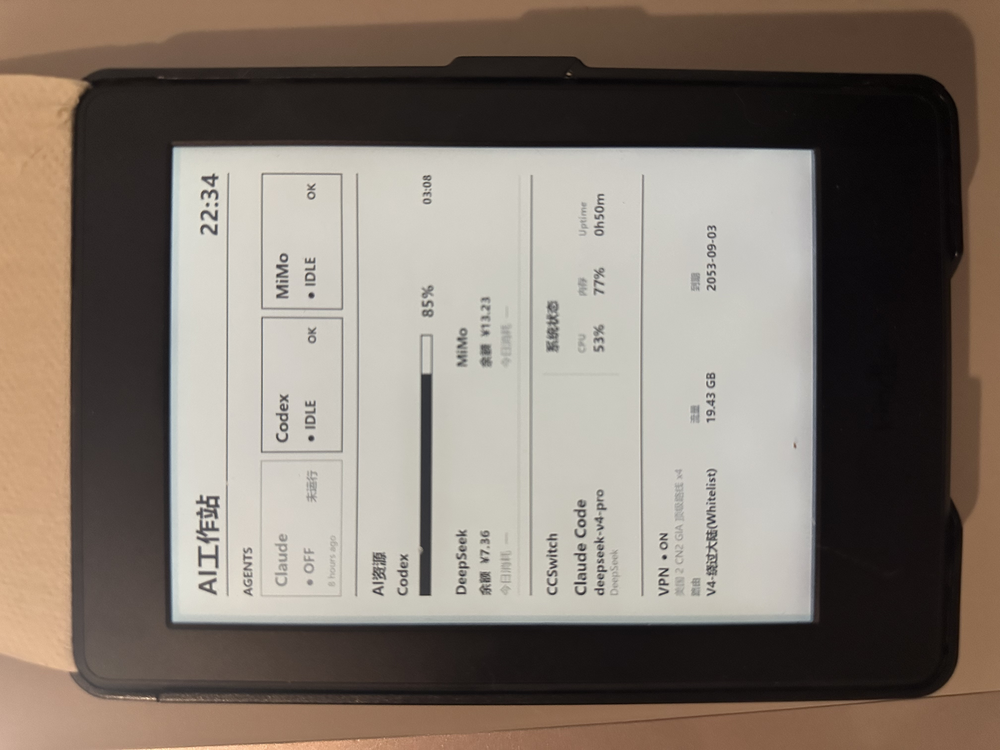

# AI Workstation

Turn your Kindle into an AI Agent command center.



Running multiple AI coding agents creates a new problem:
knowing what they are doing, when they need attention, and how much quota remains.

AI Workstation provides a lightweight local command center for AI developers.

AI Workstation is a local AI developer operations dashboard for Windows and Kindle e-ink displays. It collects activity from several coding agents and renders a compact status view for a Kindle e-ink display. It is designed for personal automation: runtime data stays on the local machine, while the repository contains the monitors, renderers, scheduler, and setup scripts.

## Features

- Claude Code monitoring
- Codex monitoring
- MiMo Code monitoring
- `WAITING_APPROVAL` detection
- Codex 5H / 7D quota monitoring
- DeepSeek balance monitoring
- MiMo balance monitoring
- CCSwitch model display
- VPN status monitoring
- Kindle e-ink dashboard
- Windows tray launcher

The application reads local agent state and optional service credentials. Missing optional integrations are reported as `NOT_CONFIGURED` or `DISCONNECTED`; they do not prevent the dashboard from rendering.

## Architecture

```text
Agent
  |
  v
Monitor
  |
  v
Dashboard JSON
  |
  v
Renderer
  |
  v
Kindle
```

The scheduler periodically runs the workstation update, writes local dashboard state, renders PNG output, and can serve the image over HTTP for a Kindle refresh script.

## Supported Agents

Claude Code:

- `RUNNING`
- `IDLE`
- `WAITING_APPROVAL`
- `STOPPED`

Codex:

- `RUNNING`
- `IDLE`
- `WAITING_APPROVAL`
- `STOPPED`

MiMo:

- `RUNNING`
- `IDLE`
- `WAITING_APPROVAL`
- `STOPPED`

## Project Layout

```text
app/
  monitors/       Agent, quota, balance, and VPN monitors
  collectors/     Local event and session collectors
  core/           State models, aggregation, and dashboard building
  hooks/          Claude hook installation and event handling
  renderer*.py    E-ink and dashboard image renderers
  workstation.py  One-shot update entry point
  scheduler.py    Periodic update loop
  tray.py         Windows tray launcher
config/           Example configuration files
data/             Local generated state; ignored by Git
docs/             Architecture, setup, and development notes
extensions/       Kindle refresh extension scripts
scripts/          Windows helper scripts
```

## Installation

The supported development environment is Windows with Python 3.11 or newer.

```powershell
python -m venv .venv
.\.venv\Scripts\Activate.ps1
python -m pip install -r requirements.txt
```

Optional integrations use environment variables. Copy `.env.example` to `.env` and fill in only the services you use. Never commit `.env`.

The application also reads local user data when available:

- Claude Code: `%USERPROFILE%\.claude`
- Codex Desktop: `%USERPROFILE%\.codex`
- MiMo Code: `%USERPROFILE%\.local\share\mimocode`
- CCSwitch: `%USERPROFILE%\.cc-switch`
- v2rayN: the standard local installation under `%USERPROFILE%\Downloads`

## Running

Run one dashboard update:

```powershell
python -m app.workstation
```

Render the standalone dashboard images:

```powershell
python -m app.main
```

Start the periodic scheduler:

```powershell
python -m app.scheduler
```

Start the Kindle image server or Windows tray launcher when needed:

```powershell
python -m app.kindle_server
python -m app.tray
```

`run.bat`, `start.bat`, and `scripts/start_workstation.bat` provide Windows shortcuts for common flows.

## Screenshots

Place public screenshots in [`docs/images/`](docs/images/). Do not place screenshots containing usernames, tokens, private paths, account identifiers, or live subscription details in the repository.

## Privacy and Security

This project is intended to be published without local runtime data. Before committing, check that the following are absent from the staged files:

- `.env` and service credentials
- API keys, cookies, bearer tokens, and VPN subscription URLs
- `data/`, `logs/`, `output/`, SQLite databases, and JSONL event logs
- personal Windows paths or screenshots containing private information

The repository intentionally keeps generated runtime files out of Git through `.gitignore`.

## License

Add a license before publishing if this project will be reused by others. Until then, treat the repository as source-available with no implied license.